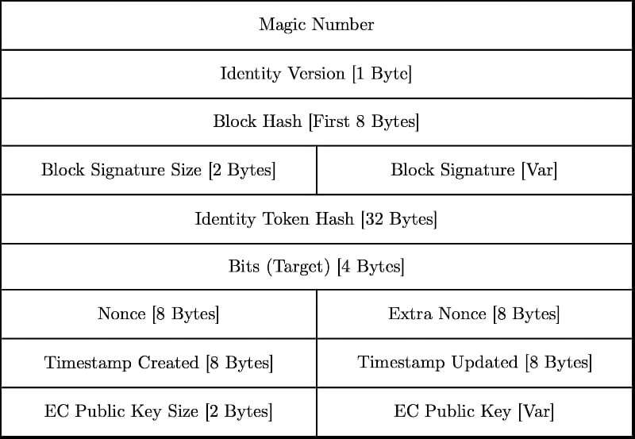

# Nomicle File Structure

[← Back to Developer Documentation](../README.md)

*Specification Version 0*

The Nomicle file format is open, albeit not yet standardised given that it is still in an experimental stage. Anyone can write software that can read or create Nomicle identity blocks. We've already gone ahead and written the first two programs to do that (see the [Nomicle Downloads](../download.md) page as well as [xTalk](https://github.com/alimahouk/xtalk), which also reads nomicles). You can use their source code as a reference for how to build nomicle parsing capabilities into your own apps.

Nomicle identity files are binary and use the `.ncle` file extension.

## Fields

### Magic Number [9 Bytes]

The beginning of a nomicle is demarcated by the following byte sequence: `0x89, 0x50, 0x44, 0x48, 0x5a, 0x0d, 0x0a, 0x1a, 0x0a`

### Identity Version [1 Byte]

A node uses this field to determine what version of the protocol this nomicle was conforming to when it was built. This allows the node to parse the block according to the rules defined by that version of the specification.

### Block Hash [First 8 Bytes]

A SHA256 checksum of the entire nomicle, excluding the magic number, the signature, and the checksum itself. Only the first 8 bytes of the checksum are actually stored within the nomicle; this suffices when comparing against a calculated checksum again in the future and helps minimise memory footprint.

### Signature Size [2 Bytes]

The byte length of the nomicle's signature, which follows this field.

### Signature [Var]

Once a nomicle's checksum has been computed, it is signed using the owner's private elliptic curve key to generate this ECDSA signature.

### Identity Token Hash [32 Bytes]

A SHA256 hash of the user's chosen identifier.

### Bits (Target) [4 Bytes]

The target (a signed numerical value) that this nomicle's proof-of-work satisfies stored in a compact, mantissa-exponent encoding. The first byte stores an exponent and the following three bytes represent the mantissa. e.g. if the difficulty bits value is `0x1103e50b`. The first part, `0x11`, is a hexadecimal exponent, and the next part, `0x03e50b`, is the mantissa.

### Nonce [8 Bytes]

An integer value that when appended to the nomicle's checksum should produce a hash value that satisfies the claimed difficulty of the block.

### Extra Nonce [8 Bytes]

This is an extra field provided for use in the case the nonce field overflows.

### Timestamp Created [8 Bytes]

The Unix epoch time when the nomicle was first mined. Nodes will reject a block that is set more than two hours into the future.

### Timestamp Updated [8 Bytes]

The Unix epoch time when the nomicle's bits were last modified.

### EC Public Key Size [2 Bytes]

The byte length of the nomicle's elliptic curve public key, which follows this field.

### EC Public Key [Var]

The public key of the private key used to sign the nomicle. This is a secp256k1 elliptic curve key.
